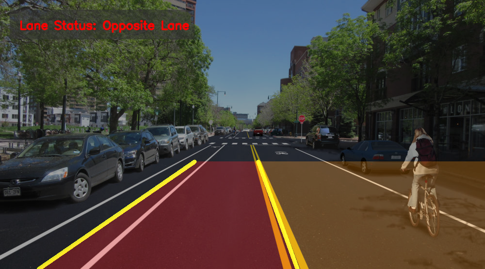
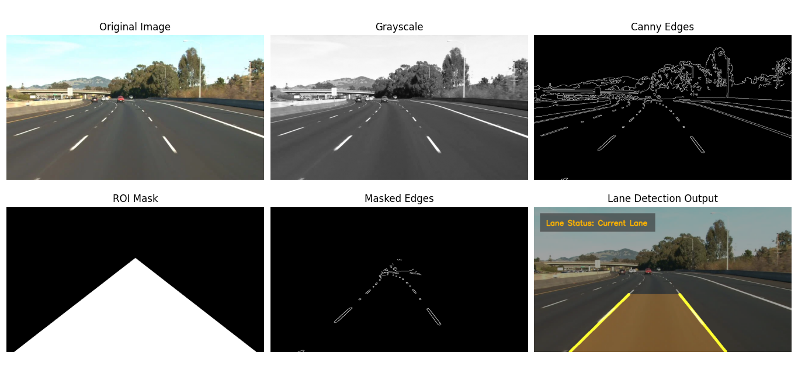
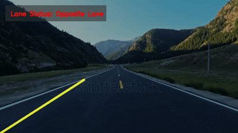

# Lane Detection Project


*Caption: Lane detection result on a sample road image.*

Detect and visualize road lanes on images and videos using **OpenCV** and **NumPy**. This project highlights lanes with colored overlays, determines lane status (current/opposite), and provides a 2×3 grid of intermediate processing steps for better analysis.


*Caption: 2×3 visualization grid showing each processing step.*



*Caption: Lane detection demo in motion.*

---

## Features
- **Lane Detection**: Detects left and right lanes using Canny edge detection and Hough Transform.
- **Lane Overlay**: Colored overlays for lane areas:
  - **Current lane** ➔ Green/Orange
  - **Opposite lane** ➔ Red
- **Lane Status**: Determines whether the vehicle is in the current lane or opposite lane.
- **Video Handling**: Maintains previous frame lane data to handle missing lanes in videos.
- **Visualization Grid**: Generates a 2×3 grid showing:
  - Original image
  - Grayscale
  - Gaussian blur
  - Canny edges
  - ROI mask
  - Final lane detection output
- **Output Saving**: Saves images and videos with lane overlays.

---

## Folder Structure
```
lane-detection/
│
├── images/                  # Input images
│   └── lane_5.jpg
│
├── videos/                  # Input videos
│   └── lane_6.mp4
│
├── outputs/                 # Processed images/videos
│   └── lane_detection_output.png
│   └── lane_detection_grid.png
│   └── lane_detected.mp4
│
├── lane_detection_image.py  # Image-based lane detection script
├── lane_detection_video.py  # Video-based lane detection script
├── requirements.txt         # Python dependencies
└── README.md
```

---

## Installation
Install dependencies using pip:
```bash
pip install -r requirements.txt
```

**requirements.txt**
```text
opencv-python
numpy
matplotlib
```

---

## Usage

### Image Lane Detection
```bash
python lane_detection_image.py
```
- Saves outputs in `outputs/` folder:
  - `lane_detection_output.png` ➔ final image with lane overlay  
  - `lane_detection_grid.png` ➔ 2×3 grid of processing steps  

### Video Lane Detection
```bash
python lane_detection_video.py
```
- Saves processed video as `outputs/lane_detected.mp4`  
- Lane overlay shows current vs opposite lane using colors  

---

## Lane Status Detection
- Lane position is referenced from the image center.  
- **Current Lane** ➔ Orange/Green overlay  
- **Opposite Lane** ➔ Red overlay  

---

## Author
- **M Awais**  
- Email: awaisahmadd555@gmail.com  

---

## License
This project is open-source and free to use for learning and experimentation.